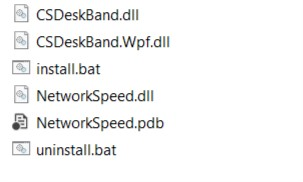
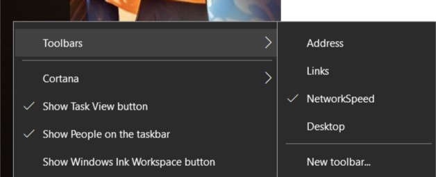
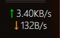

# NetworkSpeed

网速显示小插件，基于`C#`，`.NET`框架为`4.6.1`。

## 安装及使用

- 准备：安装相应版本的`.NET`框架。

- 下载`Release`中最新版本，解压后：

- 以管理员身份运行`install.bat`文件。

  **注**：此文件运行后会重启`explorer`进程，开启的文件浏览器（文件夹等）会被关闭。

- 在桌面任务栏上，单击右键，依次选择**工具栏(toobar)** -> **NetworkSpeed**，即可开启此插件。

​	**注**：如果选择**工具栏(toolbar)**之后没有出现**NetworkSpeed**选项，可进行注销后重新尝试。

- 最终结果：

  

**注**：一旦安装成功并且运行之后，文件夹内的文件不能删除，也不能移动、复制等。要想移动文件及文件夹位置，需先停用此插件且卸载、注销之后，再进行重新安装。

## 卸载

管理员身份运行安装文件夹下`uninstall.bat`。

## 已知问题

- 显示缩放问题：在显示缩放不是`100%`时，显示结果有可能会不居中，右侧的显示文字有可能会被遮挡，无法显示。